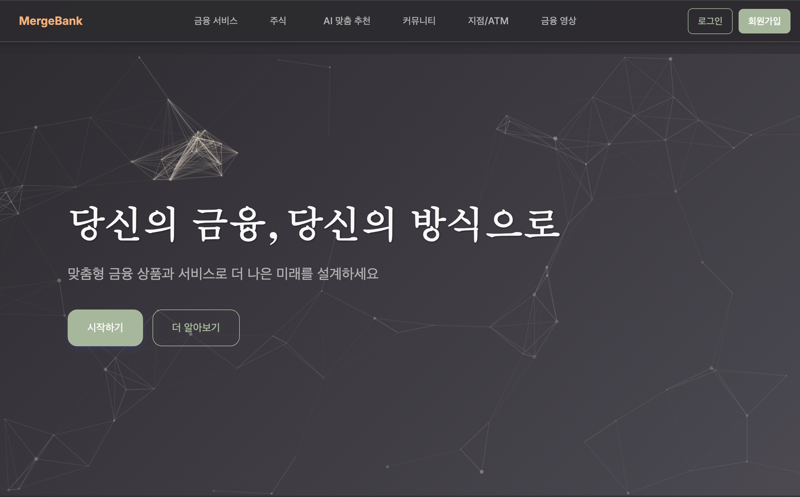
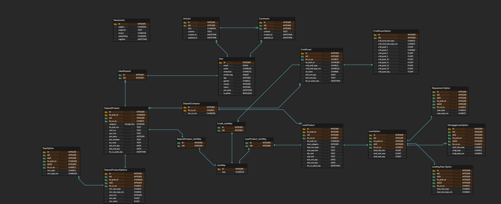
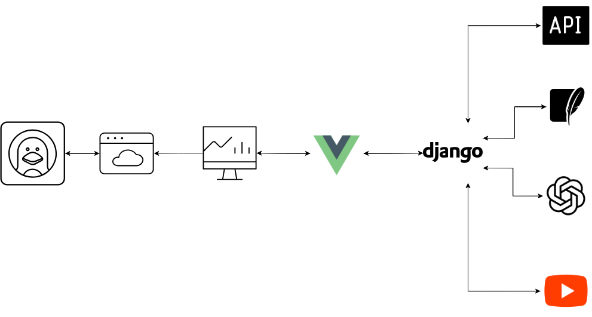

# MergeBank
 

## 프로젝트 이름
MergeBank는 "Merge"와 "Bank"의 합성어로, 다양한 금융 상품과 서비스를 통합하여 사용자에게 최적의 금융 솔루션을 제공하는 플랫폼을 의미합니다.

## 프로젝트 개요

본 프로젝트는 사용자별 맞춤형 금융 상품 추천과 금융 관련 학습 콘텐츠를 제공하는 종합 금융 플랫폼입니다. 사용자의 재정 상황과 목표에 따라 최적의 금융 상품(예금, 적금, 대출)을 추천하고, 금융 교육 콘텐츠를 통해 금융 지식을 향상시키는 기회를 제공합니다.  
프로젝트는 Django REST Framework를 백엔드로 사용하고, Vue.js를 프론트엔드로 사용하여 개발되었습니다. 또한, OpenAI API를 활용한 AI 금융 상담 서비스와 YouTube Data API를 통한 금융 교육 콘텐츠 제공 기능을 포함하고 있습니다.  

## 프로젝트 기간
2025.05.22 ~ 2025.05.28

## 팀원 및 역할

<table style="text-align:center; width:60%; align:center;">
    <tr>
        <th>팀장</th>
        <th>팀원</th>
    </tr>
   <tr>
      <td></td>
      <td></td>   
   </tr>
   <tr>
      <td><a href="https://github.com/ryongseong">임성룡</a>&nbsp;&nbsp;<b>FE,BE,AI</b></td>
      <td><a href="https://github.com/lee-gi-tae">이기태</a>&nbsp;&nbsp;<b>FE,BE,UI/UX</b></td>
   </tr>
    <tr>
      <td style="word-break: keep-all">DB설계, 프로젝트 초기세팅, 인증/인가, 메인페이지, 마이페이지, 게시판, AI 프롬프팅</td>
      <td style="word-break: keep-all">UI설계, 상품비교, 메인페이지, 은행 지점검색, 게시판</td>
   </tr>
</table>

## 주요 기능

### 1. 계정 관리
- 회원가입/로그인 (소셜 로그인 지원: Google, Kakao)
- JWT 인증을 통한 보안 강화
- 사용자 프로필 관리 및 개인정보 설정
- 재정 상황(소득, 자산 등) 등록 및 관리

### 2. 금융 상품 관리
- 다양한 금융 상품 정보 조회 (예금, 적금, 대출)
- 사용자 맞춤형 금융 상품 추천
- 금융 상품별 상세 정보 및 비교 기능

### 3. 커뮤니티 기능
- 금융 관련 게시글 작성 및 공유
- 댓글 및 좋아요 기능으로 소통
- 인기 게시글 추천

### 4. 금융 교육 콘텐츠
- YouTube를 통한 금융 관련 교육 동영상 제공
- 관심 동영상 저장 및 노트 기능
- 맞춤형 금융 교육 콘텐츠 추천

### 5. AI 서비스
- 금융 상담 서비스 (OpenAI API 활용)
- 금융 상품 분석 및 개인화된 추천
   - 사용자의 자산과 월급에 따라 다르게 추천하며 예상 수익금 반환

## 기술 스택

### 백엔드
[](https://www.python.org/)
[](https://www.django-rest-framework.org/)
[](https://www.djangoproject.com/)
[](https://www.sqlite.org/)
- **인증**: JWT, Django REST Auth
- **데이터베이스**: SQLite
- **API 문서화**: drf-spectacular
- **외부 API**: 금융상품 API, YouTube Data API, OpenAI API

### 프론트엔드
[](https://developer.mozilla.org/docs/Web/JavaScript)
[](https://vuejs.org/)
[](https://vitejs.dev/)
[](https://getbootstrap.com/)
[](https://axios-http.com/)
[](https://www.chartjs.org/)
[](https://vue-i18n.intlify.dev/)
- **프레임워크**: Vue.js 3, Pinia (상태 관리)
- **UI/UX**: Bootstrap 5, FontAwesome
- **차트 및 시각화**: Chart.js
- **국제화**: Vue-i18n
- **HTTP 클라이언트**: Axios
- **빌드 도구**: Vite

### 도구
[](https://code.visualstudio.com/)
[](https://git-scm.com/)
[](https://github.com/)
[](https://gitlab.com/)
[](https://figma.com/)
[](https://www.notion.so/)
[](https://www.postman.com/)
- **개발 환경**: Visual Studio Code
- **버전 관리**: Git
- **프로젝트 관리**: Notion, Figma
- **협업 도구**: GitHub, GitLab

## 프로젝트 실행 방법
프로젝트를 로컬 환경에서 실행하기 위해서는 백엔드와 프론트엔드 각각의 설정이 필요합니다. 아래의 단계를 따라 진행해주세요.

### 필수 요구사항
- Python 3.9+
- Node.js 22+
- npm 9+
- Django 4.2+
- Vue.js 3.x
- Vite 4.x

### 백엔드 설정

```bash
git clone https://github.com/MergeBank/BackEnd.git
# 백엔드 폴더로 이동
cd BackEnd

# 가상환경 생성 및 활성화
python -m venv venv
source venv/bin/activate  # Windows: venv\Scripts\activate

# 의존성 설치
pip install -r requirements.txt

# 환경 변수 설정 (.env 파일 생성)
# FINANCE_API=
# EXCHANGE_RATE_API=
# DEPOSIT_PRODUCT_API=
# GOOGLE_CLIENT_ID=
# GOOGLE_CLIENT_SECRET=
# KAKAO_CLIENT_ID=
# OPENAI_API_KEY=
# YOUTUBE_API=

# 데이터베이스 마이그레이션
python manage.py migrate

# 서버 실행
python manage.py runserver
```

### 프론트엔드 설정

```bash
git clone https://github.com/MergeBank/FrontEnd.git
# 프론트엔드 폴더로 이동
cd FrontEnd

# 의존성 설치
npm install

# 환경 변수 설정 (.env 파일 생성)
# VITE_KAKAO_API=
# VITE_KAKAO_CLIENT_ID=
# VITE_GOOGLE_CLIENT_ID=
# VITE_GOOGLE_CLIENT_SECRET=

# 개발 서버 실행
npm run dev
```

## 프로젝트 문서
프로젝트 문서는 Notion에서 관리하고 있습니다. [여기서 확인하세요](https://victorious-avocado-170.notion.site/1f9c03636f8880edb17ff132f2a81c2b?v=1f9c03636f8880d1bdaf000cf7e58559&source=copy_link).

## API 명세

### 계정 API
- `POST /accounts/register/` - 회원가입
- `POST /accounts/login/` - 로그인
- `GET /accounts/profile/` - 사용자 프로필 조회
- `PUT /accounts/profile/` - 프로필 업데이트
- `POST /accounts/google/login/` - Google 소셜 로그인
- `POST /accounts/kakao/login/` - Kakao 소셜 로그인

### 금융상품 API
- `GET /products/deposit/` - 예금 상품 목록 조회
- `GET /products/saving/` - 적금 상품 목록 조회
- `GET /products/loan/` - 대출 상품 목록 조회
- `GET /products/recommend/` - 맞춤형 상품 추천

### 커뮤니티 API
- `GET /articles/` - 게시글 목록 조회
- `POST /articles/` - 게시글 작성
- `GET /articles/<id>/` - 게시글 상세 조회
- `PUT /articles/<id>/` - 게시글 수정
- `DELETE /articles/<id>/` - 게시글 삭제
- `POST /articles/<id>/like/` - 게시글 좋아요 토글
- `GET /articles/<id>/comments/` - 댓글 목록 조회
- `POST /articles/<id>/comments/` - 댓글 작성

### YouTube API
- `GET /youtube/videos/search/?q=query` - YouTube 영상 검색
- `GET /youtube/saved/` - 저장된 영상 목록 조회
- `POST /youtube/saved/` - 영상 저장
- `PATCH /youtube/saved/<id>/` - 저장된 영상 노트 수정
- `DELETE /youtube/saved/<id>/` - 저장된 영상 삭제

## 프로젝트 구조

```
MergeBank

BackEnd/
├── accounts/       - 사용자 계정 관리
├── articles/       - 커뮤니티 게시글 관리
├── products/       - 금융 상품 관리
├── youtube/        - YouTube 영상 관리
├── final_pjt/      - 프로젝트 설정
├── media/          - 미디어 파일 저장
└── requirements.txt

FrontEnd/
├── public/
├── src/
│   ├── assets/     - 정적 파일
│   ├── components/ - Vue 컴포넌트
│   ├── router/     - Vue Router 설정
│   ├── services/   - API 서비스
│   ├── stores/     - Pinia 스토어
│   ├── utils/      - 유틸리티 함수
│   ├── views/      - 페이지 뷰
│   ├── App.vue     - 루트 컴포넌트
│   └── main.js     - 진입점
├── package.json
└── vite.config.js
```

## ERD


## 아키텍처 설계

